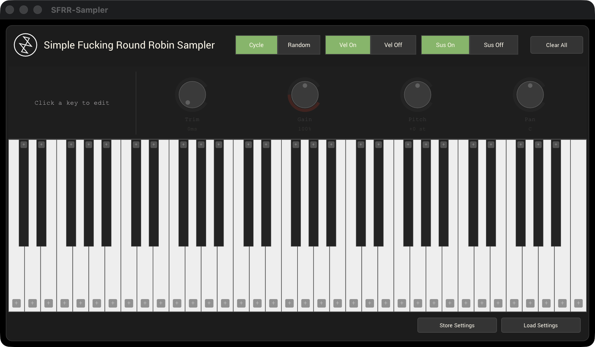

# SFRR-Sampler

**Simple Fucking Round Robin Sampler** — a free, open-source multi-sampler plugin built for fast, intuitive round-robin sample playback.

Made by [Stereokroma](https://stereokroma.com).



---

## Download

Pre-built macOS binaries are in the [Releases](https://github.com/Stereokroma/SFRR-Sampler/releases) section.

| Platform | Format | Status |
|----------|--------|--------|
| macOS | AU (Audio Unit v2) | ✅ |
| macOS | VST3 | ✅ |
| Windows | VST3 | 🔜 needs testing — see [Contributing](#contributing) |

### Installation (macOS)

**AU:** Copy `SFRR-Sampler.component` → `~/Library/Audio/Plug-Ins/Components/`

**VST3:** Copy `SFRR-Sampler.vst3` → `~/Library/Audio/Plug-Ins/VST3/`

Restart your DAW after installing.

---

## Features

- **Per-key sample loading** — click `+` on any piano key to assign a folder of WAV or AIFF files
- **Round-robin playback** — Cycle (sequential) or Random (no-repeat) mode
- **Velocity sensitivity** — toggle velocity-to-volume mapping on or off
- **Sustain mode** — when ON, samples play to their natural end; note-off never cuts them short
- **Per-key editor** — click any key to open its controls:
  - **Trim** — skip the first 0–500 ms of the sample (useful for samples with silence at the start)
  - **Gain** — 0–200%, unity at 100%
  - **Pitch** — coarse tuning ±12 semitones
  - **Pan** — stereo placement L to R
  - Double-click any knob to reset to default
- **Preset save/load** — Store and Load Settings buttons save your full setup (all sample paths and per-key values) to a `.sfrr` file
- **DAW state saving** — all loaded samples and settings persist in your DAW project automatically
- **Clear All** — unload all keys at once with confirmation

---

## Building from Source

### macOS

**Requirements:** macOS 11+, Xcode 13+

```bash
git clone https://github.com/iPlug2/iPlug2.git
cd iPlug2/Dependencies/IPlug && ./download-iplug-sdks.sh && cd ../../..
git clone https://github.com/Stereokroma/SFRR-Sampler.git iPlug2/Examples/RobinSampler
open iPlug2/Examples/RobinSampler/projects/IPlugInstrument-macOS.xcodeproj
```

Select the target and build:

| Target | Output |
|--------|--------|
| `AU` | `~/Library/Audio/Plug-Ins/Components/SFRR-Sampler.component` |
| `VST3` | `~/Library/Audio/Plug-Ins/VST3/SFRR-Sampler.vst3` |
| `APP` | `~/Applications/SFRR-Sampler.app` (standalone, Debug only) |

### Windows

**Requirements:** Visual Studio 2019+ with C++ desktop workload

```
git clone https://github.com/iPlug2/iPlug2.git
cd iPlug2\Dependencies\IPlug && download-iplug-sdks.bat
git clone https://github.com/Stereokroma/SFRR-Sampler.git iPlug2\Examples\RobinSampler
```

Open `iPlug2\Examples\RobinSampler\projects\IPlugInstrument-vst3.vcxproj` in Visual Studio.

Audio loading uses `dr_wav.h` (bundled) for WAV and AIFF support. The Windows build has not yet been tested — if you get it working, please open a PR.

---

## Contributing

The most wanted contribution right now is a tested Windows build. All the cross-platform code is already written:

- ✅ Audio loading (`dr_wav.h`, handles WAV + AIFF)
- ✅ Directory scanning (Win32 `FindFirstFile` / `FindNextFile`)
- ✅ Font paths (`C:\Windows\Fonts\cour.ttf`, `courbd.ttf`)
- ✅ Project and binary name settings

Clone the repo, attempt a build with Visual Studio, fix any remaining errors, and open a PR.

---

## License

Free to use for any personal, educational, or music production purpose. You may not sell or commercially redistribute this software. See [LICENSE](LICENSE) for full terms.

---

## Credits

- Framework: [iPlug2](https://iplug2.github.io/) by Oli Larkin and contributors
- Plugin: [Stereokroma](https://stereokroma.com)
